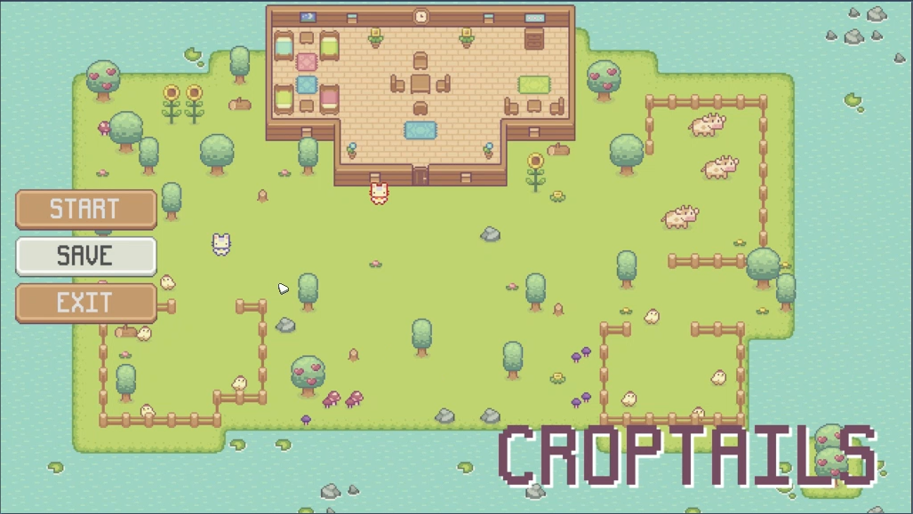

# 🌱 Croptails (Godot Game)

## Overview

This project is my first step into game development using the **Godot Engine**. It is based on the *Croptails* tutorial from YouTube, where I followed along to build a small farming-style game and then extended it with a few personal modifications.

The game focuses on simple mechanics such as planting, growing, and harvesting crops.

> ⚠️ This project is not fully complete or published. It is primarily a learning project.

---

## Gameplay Features

* Basic farming mechanics (till soil, plant seeds, harvest crops)
* Player movement and interaction
* Simple time-based crop growth system
* Basic Inventory system
* NPC interaction and dialogue
* Saving and loading mechanism

---

## Technologies Used

* **Godot Engine**
* **GDScript**

---

## What I Learned

Through this project, I gained hands-on experience with:

* Godot's scene and node system
* Scripting using GDScript
* Implementing State machines
* Handling player input
* Adding dialogue
* Creating tile sets
* Managing resources

---

## Personal Improvements

After completing the tutorial, I experimented by adding small enhancements such as:

* extending saving mechanism from only saving TilledSoil layer to also save inventory and enabled tools.
* fixing unwanted focus change when using keys.
* changing displayed text on button from 'Start' to 'Resume' when resuming game.
* preventing game from reloading when pressing 'Resume' button.
* randomizing NPC sound effects wait times.

---

## Project Status

* ✔ Tutorial completed
* ✔ Core mechanics implemented
* ⏳ Not fully polished
* ⏳ Not published

---

## Future Improvements

Some ideas for future development:

* Extend saving system for other layers and entities
* Add more tools and items
* Add other levels
* Add goals and missions
* Introduce more NPCs
* Enhance UI/UX
* Add more sound effects

---

## Acknowledgments

* Tutorial inspiration: *Croptails* YouTube tutorial
* Thanks to the Godot community for learning resources

---

## Contact

Feel free to connect with me or check out my other projects!

---

⭐ If you like this project, feel free to give it a star!
